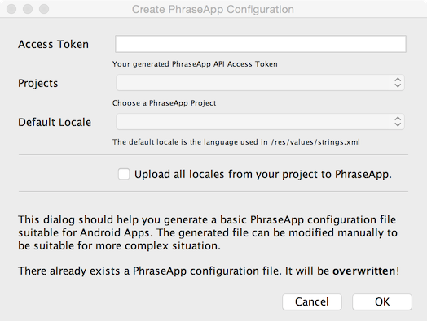
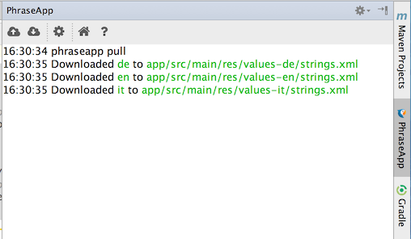

# phrase-intellij

Plugin to sync translations with Phrase for Android Studio.

### Phrase

Phrase helps you manage translations. With this plugin it is integrated tightly into Android Studio. Read more about Android app localization and Phrase integration [in our blog post.](https://phrase.com/blog/posts/android-how-to-translate-apps-in-android-studio/)

### Download and Installation

Go to the plugin settings page (**File > Settings > Plugins** on Windows and Linux, **Android Studio > Preferences... > Plugins** on MacOS X). You can either install it using the repository browser, or [manually download](https://plugins.jetbrains.com/plugin/7686?pr=androidstudio) it and then use the *Install plugin from disk...* button. After a restart of Android Studio the plugin is ready for configuration.

### Configuration

The plugin relies on the [Phrase CLI client](https://github.com/phrase/phrase-cli), i.e. it must be [installed](https://github.com/phrase/phrase-cli#1-install) first. The client path (the location the binary is found at) must be specified in the **Tools > Phrase** settings (or preferences on MacOS X) dialog. This dialog will try to determine the path using some heuristics, but it might be necessary to specify the path manually.

Besides client path configuration each project needs a configuration, too. A basic configuration can be generated using the **Tools > Phrase > Create Config** dialog (it will pop up automatically if any action requiring the configuration is triggered, but it wasn't created yet). The following values must be specified:

* The Access Token: This can be generated in [your account](https://phrase.com/settings/oauth_access_tokens) and must be specified here.
* The project to use: After the Access Token was specified the project list will be updated. If there is no project in your account one can be generated automatically (named after the Android Studio project).
* The key's locale: The locale the keys are in your project are in.

You can of course create your own file, or modify the generated one to your needs. For more information on the configuration file check out [this documentation page](https://help.phrase.com/help/phrase-for-developers).

### Usage

There are two major actions the plugin can be used for:

* Pushing the current keys file to Phrase.
* Pulling the translations from Phrase to your project.

Both are accessible from the menubar (under *Tools -> Phrase*) and the tool window (located to the right of the editor window).

Valid locale files (named `strings.xml`) can be manually uploaded from the respective context menu in the project view.

